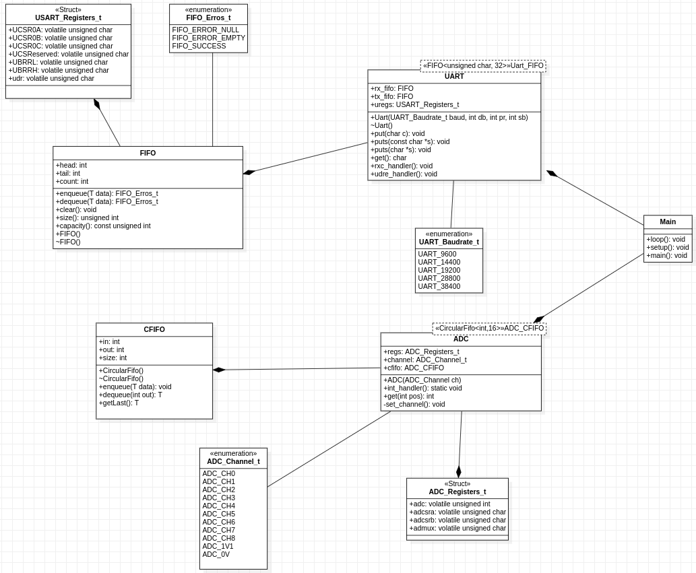

# IFSC STE 2022.2 - Biblioteca para o ATMega328P

Esta é uma biblioteca para uso de componentes do <a href="https://ww1.microchip.com/downloads/en/DeviceDoc/Atmel-7810-Automotive-Microcontrollers-ATmega328P_Datasheet.pdf">ATmega328P</a> (MCU presente no Arduino Uno) utilizando o GCC. O objetivo deste projeto é estudar e conhecer a MCU AVR em uso e, neste processo, aplicar conceitos de projeto de sistemas embarcados. A linguagem-base da biblioteca é C++, embora alguns trechos de código podem conter sequências C ou em assembly.

# Projeto 1 

Este projeto tem o intuito de realizar a leitura de uma porta analógica e por meio de 16 medições atualizar sua média por meio de um microcontrolador ,sendo assim para cada leitura é necessário imprimir-la juntamente com o valor de média atualizado. Para resolução deste sistema primeiramente é necessário uma UART com filas de entrada e saída para poder imprimir as medições e o valor médio,segundamente uma fila circular que será utilizado pelo ADC que o mesmo acabando sendo o último componente que irá entregar esses dois componentes para resolução do sistema. Em ambos componentes componentes UART e ADC implementados foram utilizados bits e registradores informados no <a href="https://ww1.microchip.com/downloads/en/DeviceDoc/Atmel-7810-Automotive-Microcontrollers-ATmega328P_Datasheet.pdf">Datasheet</a> que deveria ser ligados e interrupções que seriam necessárias para a implementação da biblioteca,sendo assim após a leitura do mesmo foi possível identificar a memória dos registradores a serem utilizados assim como quais bits devem ser ligados para possuir as características desejadas para uso de interrupções e polling. 
## Diagrama UML 

</img>

# FIFO

A estrutura de dado FIFO("first in first out") foi implementada para ser usada dentro do componente da UART,pois como o funcionamento da UART é de forma serial com o terminal é necessário esta estrtura de dado para adequar-se ao comportamento dos requisitos do projeto.
## Atributos
```cpp
T buffer[N]: Formato da fila é um buffer de tamanho N;
int head, tail, count: Head é o começo da fila, tail representa o final da mesma e count o número de dados que existem na fila.
```

## Métodos 
```cpp
FIFO_Erros_t enqueue(T data): Responsável por enfileirar um dado recebido por parâmetro na fila e retorna um ENUM que representa uma mensagem.
FIFO_Erros_t dequeue(T *data): Responsável por desinfeileirar um dado dentro da fila e passa-lo para o dado de parâmetro.
```
# UART

A UART implementada tem o propósito neste projeto de receber bytes de dados do componente ADC e transmitir os bits individuais de forma seqüencial para informar o valor medido no terminal. Basicamente o funcionamento deste componente foi possível por meio de interrupções proporcionado pela técnica de polling onde o dispositivo verifica constantemente se é necessário realizar a ação específicada pelo software.
## Atributos

```cpp
static USART_Registers_t *uregs: Esta váriavel é responsável por armazenar os valores referentes aos registradores da USAR.
static Uart_FIFO tx_fifo: A fila de transmissão que contém os dados recebidos da transmissão.
static Uart_FIFO rx_fifo: A fila de recepção que contém os dados armazenados pelo hardware.
```

## Métodos 
```cpp
Uart(Uart::UART_Baudrate_t baud, int db = 8, int pr = 0, int sb = 1): Construtor de uma Uart que é necessário informar o Baundrate, data bits, parity e stop bit referente ao terminal usado.
void put(char c): Enfileiramento da transmissão.
char get(): Captura dado da fila de recepção.
static void rxc_handler(): Retira dado colocado no harware e coloca na fila.
static void udre_handler(): Desinfeileira a transmissão recebida e coloca no hardware.
```
# CFIFO

A fila circular ela foi implementado a ser utilizado pelo componente adc,pois a relação entre sinal processado ao modo que chega na fila cada um deles possui um "tempo de vida" limitado ao qual se deseja realizar uma recepção de 16 valores lidos e se obter a média dos mesmos.
## Atributos

```cpp
T buffer[N]: Formato da fila é um buffer de tamanho N.
int head: Head é o começo da fila.

```
## Métodos 
```cpp
void enqueue(T data): Enfileira dado na fila circular.
T get(int pos): Retorna um dado referente a posição passada por parâmetro.
```
# ADC
O componente conversor analógico para digital foi implementado por meio de interrupção do hardware ATmega328P,sendo assim toda vez que o hardware recebe um dado ele dispara uma interrupção e segue a lógica implementada pela biblioteca.
## Atributos
```cpp
static ADC_Registers_t * regs: Esta váriavel é responsável por armazenar os valores referentes aos registradores da ADC.
static ADC_CFIFO cfifo: A fila circular responsável por armazenar dados enviados pelo componente ADC.
ADC_Channel_t channel: Variável indica qual canal está sendo usado pelo componente ADC.
```
## Métodos 

```cpp
ADC(ADC_Channel_t ch): Construtor de um ADC que é necessário passar um canal.
static void int_handler(): Função de tratamento de interrupção a ser chamada pelo hardware.
```
<h1 align='center'>Autores</h1>

<a href="https://github.com/jeffersonbcr">
    <br/>
    <sub><b>Jefferson Botitano</b></sub></a>

<br><br/>

<a href="https://github.com/arliones">
    <br/>
    <sub><b>Arliones Hoeller Jr</b></sub></a>